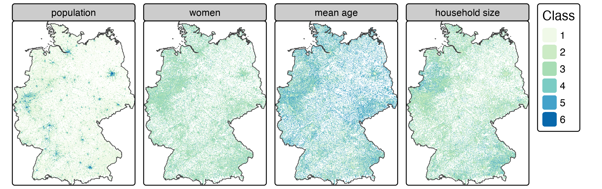
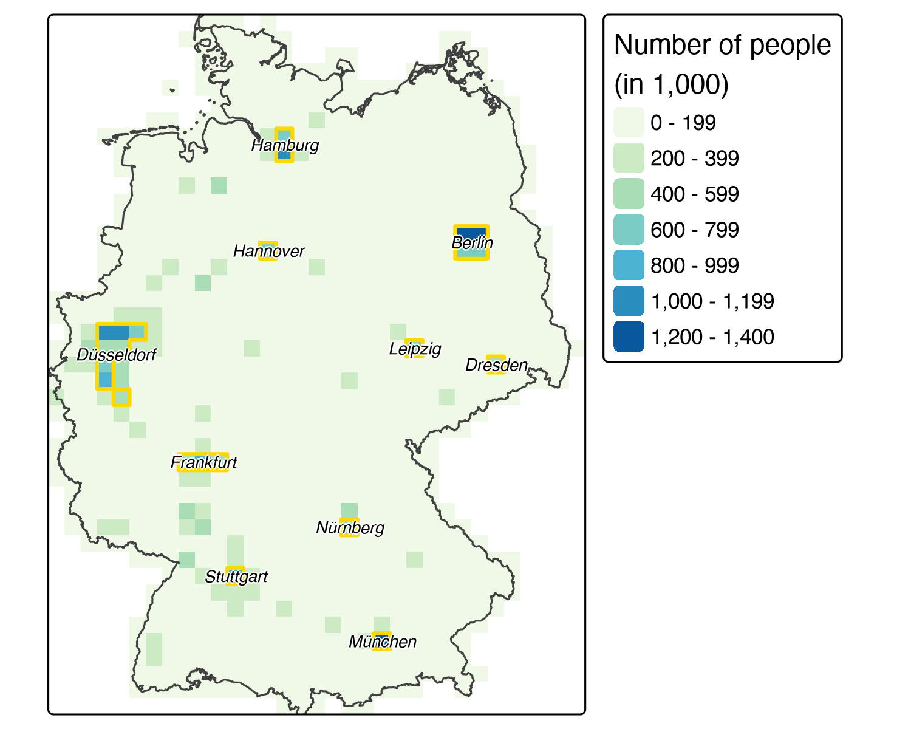

# Geomarketing{#location}

```{r, include=FALSE}
source("code/before_script.R")
```

## Wymagania wstępne{-}

- Ten rozdział wymaga następujących pakietów (należy również zainstalować**tmaptools**):

```{r 14-location-1, message=FALSE}
library(sf)
library(dplyr)
library(purrr)
library(terra)
library(osmdata)
library(spDataLarge)
library(z22)
```

Dla wygody czytelnika i w celu zapewnienia łatwej powtarzalności udostępniliśmy pobrane dane wpakiecie**spDataLarge**.

## Wprowadzenie

W tym rozdziale pokazujemy

,

jak umiejętności nabyte w częściach I i II można zastosować w konkretnej dziedzinie: geomarketing\\index{geomarketing}(czasami nazywanej również analizą lokalizacji\\index{location analysis}lub analizą lokalizacji).
Jest to szeroka dziedzina badań i zastosowań komercyjnych.Typowym
przykładem geomarketingu jest lokalizacja nowego sklepu.
Celem jest tutaj przyciągnięcie jak największej liczby klientów i ostatecznie osiągnięcie jak największego zysku.
 Istnieje również wiele niekomercyjnych zastosowań tej techniki, które mogą przynosić korzyści społeczne, na przykład lokalizacja nowych placówek służby zdrowia [@tomintz_geography_2008] .

Ludzie mają fundamentalne znaczenie dla analizy lokalizacji\\index{location analysis}, w szczególności w odniesieniu do miejsc, w których prawdopodobnie spędzają czas i wykorzystują inne zasoby.
Co ciekawe, koncepcje i modele ekologiczne są dość podobne do tych stosowanych w analizie lokalizacji sklepów.
Zwierzęta i rośliny mogą najlepiej zaspokajać swoje potrzeby w określonych „optymalnych” lokalizacjach, w oparciu o zmienne, które zmieniają się w przestrzeni (@muenchow\_review\_2018; zob. również rozdział @ref(eco)).
Jest to jedna z największych zalet geokomputacji i nauk o systemach informacji geograficznej (GIScience) w ogóle: koncepcje i metody można przenieść na inne dziedziny.Na przykład
niedźwiedzie polarne preferują północne szerokości geograficzne, gdzie temperatury są niższe, a pożywienie (foki i lwy morskie) jest obfite.
Podobnie ludzie mają tendencję do gromadzenia się w określonych miejscach, tworząc nisze ekonomiczne (i wysokie ceny gruntów) analogiczne do niszy ekologicznej Arktyki.
Głównym zadaniem analizy lokalizacji jest ustalenie, na podstawie dostępnych danych, gdzie znajdują się takie „optymalne lokalizacje” dla konkretnych usług.
Typowe pytania badawcze obejmują:

- Gdzie mieszkają grupy docelowe i jakie obszary często odwiedzają?
- Gdzie znajdują się konkurencyjne sklepy lub usługi?
- Ile osób ma łatwy dostęp do konkretnych sklepów?
- Czy istniejące usługi nadmiernie lub niedostatecznie wykorzystują potencjał rynkowy?
- Jaki jest udział danej firmy w rynku w konkretnym obszarze?

W niniejszym rozdziale pokazano, w jaki sposób geokomputacja może odpowiedzieć na takie pytania w oparciu o hipotetyczne studium przypadku i rzeczywiste dane.

## Studium przypadku: sklepy rowerowe w Niemczech{#case-study}

Wyobraź sobie, że otwierasz sieć sklepów rowerowych w Niemczech.
Sklepy powinny być zlokalizowane w obszarach miejskich, gdzie znajduje się jak najwięcej potencjalnych klientów.
Dodatkowo, hipotetyczna ankieta (wymyślona na potrzeby tego rozdziału, nie do użytku komercyjnego!) sugeruje, że najprawdopodobniej Twoje produkty kupią samotni młodzi mężczyźni (w wieku od 20 do 40 lat): to jest*grupa**docelowa*.
Masz szczęście, ponieważ dysponujesz wystarczającym kapitałem, aby otworzyć kilka sklepów.
Ale gdzie je umieścić?
Firmy konsultingowe (zatrudniająceanalitykówgeomarketingowych\\index{geomarketing}) chętnie pobierają wysokie opłaty za udzielenie odpowiedzi na takie pytania.
Na szczęście możemy to zrobić samodzielnie, korzystając z otwartych danych\\index{open data}i oprogramowania open source\\index{open source software}.
W kolejnych sekcjach pokażemy,jak techniki poznane w pierwszych rozdziałach książki można zastosować do wykonania typowych czynności związanych z analizą lokalizacji usług:

- Uporządkuj dane wejściowe z niemieckiego spisu ludności (sekcja @ref(tidy-the-input-data))
- Przekształć tabelaryczne dane spisu ludności naobiektyrastrowe\\index{raster}(sekcja @ref(create-census-rasters))
- Zidentyfikuj obszary metropolitalne o wysokiej gęstości zaludnienia (sekcja @ref(define-metropolitan-areas))
- Pobierz szczegółowe dane geograficzne (z OpenStreetMap\\index{OpenStreetMap}, za pomocą**osmdata**\\index{osmdata (package)}) dla tych obszarów (sekcja @ref(points-of-interest))
- Utwórz rastrowe\\index{raster}do oceny względnej atrakcyjności różnych lokalizacji za pomocą map algebra\\index{map algebra}(sekcja @ref(create-census-rasters))

Chociaż zastosowaliśmy te kroki do konkretnego studium przypadku, można je uogólnić do wielu scenariuszy lokalizacji sklepów lub świadczenia usług publicznych.

## Uporządkuj dane wejściowe

Rząd niemiecki udostępnia dane spisu ludności w postaci siatki o rozdzielczości 1 km lub 100 m.
 Pakiet**z22** [@R-z22] zapewnia wygodny dostęp do tych danych.
Ładujemy cztery zmienne o rozdzielczości 1 km: liczbę ludności, średni wiek, wielkość gospodarstwa domowego i odsetek kobiet.

```{r 14-location-2}
# Load Census 2022 data using z22 package
pop = z22::z22_data("population", res = "1km", year = 2022, as = "df") |>
  rename(pop = cat_0)
# Women data only available from Census 2011
women = z22::z22_data("women", year = 2011, res = "1km", as = "df") |>
  rename(women = cat_0)
mean_age = z22::z22_data("age_avg", res = "1km", year = 2022, as = "df") |>
  rename(mean_age = cat_0)
hh_size = z22::z22_data("household_size_avg", res = "1km", year = 2022, as = "df") |>
  rename(hh_size = cat_0)

census_de = pop |>
  left_join(women, by = c("x", "y")) |>
  left_join(mean_age, by = c("x", "y")) |>
  left_join(hh_size, by = c("x", "y")) |>
  relocate(pop, .after = y)
```

Należy pamiętać, że odsetek kobiet nie jest dostępny w spisie ludności z 2022 r., więc dla tej zmiennej wykorzystujemy dane ze
spisu ludności z 2011 r.W przeciwieństwie do spisu powszechnego z 2011 r., który dostarczał dane w postaci kodów klas kategorycznych, spis powszechny z 2022 r. dostarcza rzeczywiste wartości ciągłe: dokładną liczbę ludności, średni wiek w latach i średnią wielkość gospodarstwa domowego w postaci liczb dziesiętnych.
Zmienna`women`ze spisu powszechnego z 2011 r. zawiera odsetek kobiet wśród mieszkańców.

Należy pamiętać, że`census_de`jest również dostępna wpakiecie**spDataLarge**:

```{r attach-census, eval=TRUE}
data("census_de", package = "spDataLarge")
```

Następnym krokiem jest przekodowanie nieznanych wartości na`NA`.
Zmienna`women`z spisu powszechnego z 2011 r. wykorzystuje`-1`i`-9`dla nieznanych wartości; przekodowanie ich na`NA`zapewnia prawidłową obsługę w obliczeniach rastrowych i tworzeniu wykresów.

```{r 14-location-4}
# Recode unknown values (-1, -9) to NA
input_tidy = census_de |>
  mutate(across(c(pop, women, mean_age, hh_size), ~ifelse(.x < 0, NA, .x)))
```

```{r census-desc, echo=FALSE}
tab = dplyr::tribble(
  ~"class", ~"pop", ~"women", ~"age", ~"hh",
  1, "0-250", "0-40%", "0-40", "1-1.5",
  2, "250-500", "40-47%", "40-42", "1.5-2",
  3, "500-2000", "47-53%", "42-44", "2-2.5",
  4, "2000-4000", "53-60%", "44-47", "2.5-3",
  5, "4000-8000", ">60%", ">47", ">3",
  6, ">8000", "", "", ""
)
cap = paste("Classification of census variables for Figure \\@ref(fig:census-stack).",
            "Class values for population represent inhabitant counts per grid cell.",
            "For the demographic variables (women, mean age, household size),",
            "classes 1-5 correspond to weights 3-0 used in the location analysis.")
knitr::kable(tab,
             col.names = c("Class", "Population", "Women (%)", "Mean age", "Household size"),
             caption = cap,
             caption.short = "Classification of census variables.",
             align = "clcccc", booktabs = TRUE)
```

## Tworzenie rastrów spisu powszechnego

Po przetworzeniu wstępnym dane można przekształcić wobiekt`SpatRaster`(patrz sekcje @ref(raster-classes) i @ref(raster-subsetting)) za pomocąfunkcji`rast()`.
Po ustawieniuargumentu`type`na`xyz`kolumny`x`i`y`ramki danych wejściowych powinny odpowiadać współrzędnym na regularnej siatce.
Wszystkie pozostałe kolumny (tutaj:`pop`,`women`,`mean_age`,`hh_size`) będą służyć jako wartości warstw rastrowych (rysunek @ref(fig:census-stack); zobacz także`code/14-location-figures.R`w naszym repozytorium GitHub).
Należy pamiętać, że kolejność kolumn ma znaczenie: pierwsze dwie kolumny muszą być współrzędnymi x i y, więcw razie potrzebynależy użyć`select()`lub`relocate()`, aby zmienić kolejność kolumn.

```{r 14-location-5, cache.lazy=FALSE}
input_ras = rast(input_tidy, type = "xyz", crs = "EPSG:3035")
```

```{r 14-location-6}
input_ras
```

```{block2 14-location-7, type="rmdnote"}
Note that we are using an equal-area projection (EPSG:3035; Lambert Equal Area Europe), i.e., a projected CRS\index{CRS!projected} where each grid cell has the same area, here 1000 * 1000 square meters. 
Since we are using mainly densities such as the number of inhabitants or the portion of women per grid cell, it is of utmost importance that the area of each grid cell is the same to avoid 'comparing apples and oranges'.
Be careful with geographic CRS\index{CRS!geographic} where grid cell areas constantly decrease in poleward directions (see also Section \@ref(crs-intro) and Chapter \@ref(reproj-geo-data)).
```

```{r census-stack, echo=FALSE, fig.cap="Gridded German census data of 2022 (women data from 2011). See Table 14.1 for reclassification thresholds.", fig.scap="Gridded German census data."}

```

Kolejnym etapem jest przeklasyfikowanie zmiennych demograficznych (kobiety, średni wiek, wielkość gospodarstwa domowego) na wagi zgodnie z ankietą wspomnianą w sekcji @ref(case-study), przy użyciufunkcji**terra**`classify()`, która została wprowadzona w sekcji @ref(local-operations)\\index{map algebra!local operations}.

Ponieważ spis powszechny z 2022 r. dostarcza rzeczywistych wartości ciągłych, a nie kodów klas, możemy bezpośrednio wykorzystać dane dotyczące liczby ludności bez konieczności konwersji.
Daje nam to bardziej precyzyjne dane do wytyczania obszarów metropolitalnych (patrz sekcja @ref(define-metropolitan-areas)).

W przypadku pozostałych zmiennych demograficznych przeklasyfikowujemy wartości ciągłe na wagi (0-3) w oparciu o kryteria dotyczące naszej grupy docelowej (patrz tabela @ref(tab:census-desc)).
Obszary, w których populacja kobiet wynosi 0–40%, otrzymują wagę 3, ponieważ docelowa grupa demograficzna składa się głównie z mężczyzn.
Podobnie obszary o niższej średniej wieku i mniejszych gospodarstwach domowych otrzymują wyższe wagi.

```{r 14-location-8}
# Reclassification matrices for continuous values (from, to, weight)
# Women: percentage of female inhabitants
rcl_women = matrix(c(
  0, 40, 3,    # 0-40% female -> weight 3
  40, 47, 2,   # 40-47% -> weight 2
  47, 53, 1,   # 47-53% -> weight 1
  53, 60, 0,   # 53-60% -> weight 0
  60, 100, 0   # >60% -> weight 0
), ncol = 3, byrow = TRUE)

# Mean age: continuous years
rcl_age = matrix(c(
  0, 40, 3,    # Mean age <40 -> weight 3
  40, 42, 2,   # 40-42 -> weight 2
  42, 44, 1,   # 42-44 -> weight 1
  44, 47, 0,   # 44-47 -> weight 0
  47, 120, 0   # >47 -> weight 0
), ncol = 3, byrow = TRUE)

# Household size: average persons per household
rcl_hh = matrix(c(
  0, 1.5, 3,     # 1-1.5 persons -> weight 3
  1.5, 2.0, 2,   # 1.5-2 -> weight 2
  2.0, 2.5, 1,   # 2-2.5 -> weight 1
  2.5, 3.0, 0,   # 2.5-3 -> weight 0
  3.0, 100, 0    # >3 -> weight 0
), ncol = 3, byrow = TRUE)

rcl = list(rcl_women, rcl_age, rcl_hh)
```

Należy pamiętać

,

że przeklasyfikowujemy tylko kobiety, średnią wieku i wielkość gospodarstwa domowego na wagi — nie populację.
Pętla`for`\-loop\\index{loop!for}stosuje każdą macierz przeklasyfikowania do odpowiedniej warstwy rastrowej.
Warstwę populacji traktujemy oddzielnie jako rzeczywiste liczby do wykorzystania w identyfikacji obszarów metropolitalnych.

```{r 14-location-9, cache.lazy=FALSE}
# Separate population (used as counts for metro detection) from variables to reclassify
pop_ras = input_ras$pop

# Reclassify women, mean_age, hh_size into weights
demo_vars = c("women", "mean_age", "hh_size")
reclass = input_ras[[demo_vars]]
for (i in seq_len(nlyr(reclass))) {
  reclass[[i]] = classify(x = reclass[[i]], rcl = rcl[[i]], right = NA)
}
names(reclass) = demo_vars
```

```{r 14-location-10, eval=FALSE}
reclass # full output not shown
#> ...
#> names       : women, mean_age, hh_size
#> min values  :     0,        0,       0
#> max values  :     3,        3,       3
```

## Zdefiniowanie obszarów metropolitalnych

Celowo definiujemy obszary metropolitalne jako piksele o powierzchni 20 km^2^ zamieszkane przez ponad 500 000 osób.
Piksele o tak niskiej rozdzielczości można szybko utworzyć za pomocą`aggregate()`\\index{aggregation}, jak przedstawiono w sekcji @ref(aggregation-and-disaggregation).
Poniższe polecenie wykorzystuje argument`fact = 20`w celu zmniejszenia rozdzielczości wyniku 20-krotnie (należy pamiętać, że pierwotna rozdzielczość rastra wynosiła 1 km^2^).

Ponieważ dysponujemy rzeczywistymi danymi dotyczącymi liczby ludności pochodzącymi ze spisu powszechnego z 2022 r. (a nie szacunkami opartymi na średniej klasowej), możemy je bezpośrednio agregować.

```{r 14-location-11, warning=FALSE, cache=TRUE, cache.lazy=FALSE}
pop_agg = aggregate(pop_ras, fact = 20, fun = sum, na.rm = TRUE)
summary(pop_agg)
```

Kolejnym etapem jest zachowanie tylko komórek zawierających ponad pół miliona osób.

```{r 14-location-12, warning=FALSE, cache.lazy=FALSE, cache=TRUE}
pop_agg = pop_agg[pop_agg > 500000, drop = FALSE] 
```

Wykreślenie tego wykresu ujawnia kilka regionów metropolitalnych (rysunek @ref(fig:metro-areas)).
Każdy region składa się z jednej lub więcej komórek rastrowych.
Byłoby dobrze, gdybyśmy mogli połączyć wszystkie komórki należące do jednego regionu.
Polecenie**terra**'s\\index{terra (package)}`patches()`robi właśnie to.
Następnie`as.polygons()`konwertuje obiekt rastrowy na wielokąty przestrzenne, a`st_as_sf()`konwertuje go naobiekt`sf`.

```{r 14-location-13, warning=FALSE, message=FALSE, cache.lazy=FALSE}
metros = pop_agg |> 
  patches(directions = 8) |>
  as.polygons() |>
  st_as_sf()
```

```{r metro-areas, echo=FALSE, out.width="70%", fig.cap="The aggregated population raster (resolution: 20 km) with the identified metropolitan areas (golden polygons) and the corresponding names.", fig.scap="The aggregated population raster."}

```

Powstałe obszary metropolitalne odpowiednie dla sklepów rowerowych (rysunek @ref(fig:metro-areas); zobacz także`code/14-location-figures.R`w celu utworzenia rysunku) nadal nie mają nazwy.Problem ten można
rozwiązać za pomocąodwrotnego geokodowania\\index{geocoding}: na podstawie współrzędnych znajduje ono odpowiedni adres.
W związku z tym wyodrębnieniewspółrzędnychcentroid\\index{centroid}każdego obszaru metropolitalnego może służyć jako dane wejściowe dla API odwrotnego geokodowania\\index{API}.
Jest to dokładnie to, czegooczekujefunkcja`rev_geocode_OSM()`pakietu**tmaptools**.
Dodatkowe ustawienie`as.data.frame`na`TRUE`zwróci`data.frame`z kilkoma kolumnami odnoszącymi się do lokalizacji, w tym nazwą ulicy, numerem domu i miastem.
Jednak w tym przypadku interesuje nas tylko nazwa miasta.

```{r 14-location-17, warning=FALSE, message=FALSE, eval=FALSE}
metro_names = sf::st_centroid(metros, of_largest_polygon = TRUE) |>
  tmaptools::rev_geocode_OSM(as.data.frame = TRUE) |>
  select(city, town, state)
# smaller cities are returned in column town. To have all names in one column,
# we move the town name to the city column in case it is NA
metro_names = dplyr::mutate(metro_names, city = ifelse(is.na(city), town, city))
```

Aby mieć pewność

,

że czytelnik korzysta z dokładnie tych samych wyników, umieściliśmy je w**spDataLarge**jako obiekt`metro_names`.

```{r metro-names, echo=FALSE}
data("metro_names", package = "spDataLarge")
knitr::kable(select(metro_names, City = city, State = state),
             caption = "Result of the reverse geocoding.",
             caption.short = "Result of the reverse geocoding.",
             booktabs = TRUE)
```

Ogólnie rzecz biorąc, jesteśmy zadowoleni zkolumny`City`służącej jako nazwy metropolii (Tabela @ref(tab:metro-names)), z wyjątkiem dwóch przypadków: Velbert należy do regionu Düsseldorfu, a Langenhagen do Hanoweru.
W związku z tym zastępujemy te nazwy odpowiednio (Rysunek @ref(fig:metro-areas)).
Umlauty, takie jak`ü`, mogą powodować problemy w dalszej części, na przykład podczas określania obszaru metropolitalnego za pomocą`opq()`(patrz dalej), dlatego ich unikamy.

```{r 14-location-19}
metro_names = metro_names$city |>
  as.character() |>
  (\(x) ifelse(x == "Velbert", "Düsseldorf", x))() |>
  (\(x) ifelse(x == "Langenhagen", "Hannover", x))() |>
  gsub("ü", "ue", x = _)
```

## Punkty zainteresowania

\\index{point of interest}
Pakiet**osmdata**\\index{osmdata (package)}zapewnia łatwy dostęp dodanychOSM\\index{OpenStreetMap}(zobacz również sekcję @ref(retrieving-data)).
Zamiast pobierać dane dotyczące sklepów z całych Niemiec, ograniczamy zapytanie do zdefiniowanych obszarów metropolitalnych, zmniejszając obciążenie obliczeniowe i podając lokalizacje sklepów tylko w obszarach będących przedmiotem zainteresowania.
Poniższy fragment kodu realizuje to za pomocą szeregu funkcji, w tym:

- `map()`\\index{loop!map}(odpowiednik**tidyverse**dla`lapply()`\\index{loop!lapply}), która iteruje przez wszystkie nazwy metropolii, które następnie definiują ramkę ograniczającą\\index{bounding box}wfunkcji zapytaniaOSM\\index{OpenStreetMap}`opq()`(patrz sekcja @ref(pobieranie-danych))
- `add_osm_feature()`w celu określeniaelementówOSM\\index{OpenStreetMap}o wartości klucza`shop`(lista popularnych par klucz:wartośćznajduje sięnastronie[wiki.openstreetmap.org](https://wiki.openstreetmap.org/wiki/Map_Features))
- `osmdata_sf()`, która konwertujedaneOSM\\index{OpenStreetMap}na obiekty przestrzenne (klasy`sf`)
- `while()`\\index{loop!while}, która podejmuje dwie kolejne próby pobrania danych, jeśli pierwsza próba zakończyła się niepowodzeniem^\[Pobieranie danych OSM czasami kończy się niepowodzeniem przy pierwszej próbie.
  \]

Przed uruchomieniem tego kodu należy wziąć pod uwagę, że spowoduje on pobranie prawie dwóch GB danych.
Aby zaoszczędzić czas i zasoby, umieściliśmy wynik o nazwie`shops`w**spDataLarge**.
Aby udostępnić go w swoim środowisku, uruchom`data("shops", package = "spDataLarge")`.

```{r 14-location-20, eval=FALSE, message=FALSE}
shops = purrr::map(metro_names, function(x) {
  message("Downloading shops of: ", x, "\n")
  # give the server a bit time
  Sys.sleep(sample(seq(10, 15, 0.1), 1))
  query = osmdata::opq(x) |>
    osmdata::add_osm_feature(key = "shop")
  points = osmdata::osmdata_sf(query)
  # request the same data again if nothing has been downloaded
  iter = 2
  while (nrow(points$osm_points) == 0 && iter > 0) {
    points = osmdata_sf(query)
    iter = iter - 1
  }
  # return only the point features
  points$osm_points
})
```

Jest bardzo mało prawdopodobne, aby w żadnym z naszych zdefiniowanych obszarów metropolitalnych nie było żadnych sklepów.
Poniższywarunek`if`sprawdza po prostu, czy w każdym regionie znajduje się co najmniej jeden sklep.
Jeśli nie, zalecamy ponowne pobranie sklepów dla tego konkretnego regionu/regionów.

```{r 14-location-21, eval=FALSE}
# checking if we have downloaded shops for each metropolitan area
ind = purrr::map_dbl(shops, nrow) == 0
if (any(ind)) {
  message("There are/is still (a) metropolitan area/s without any features:\n",
          paste(metro_names[ind], collapse = ", "), "\nPlease fix it!")
}
```

Aby upewnić się, że każdy element listy ( ramka danych`sf`\\index{sf} ) ma te same kolumny^ [Nie jest to oczywiste] , [ponieważ autorzy OSM nie są równie skrupulatni podczas gromadzenia danych.] Zachowujemy tylkokolumny`osm_id`i`shop`za pomocąpętli`map_dfr` ,która dodatkowo łączy wszystkie sklepy w jeden dużyobiekt`sf`\\index{sf}.

```{r 14-location-22, eval=FALSE}
# select only specific columns
shops = purrr::map_dfr(shops, select, osm_id, shop)
```

Uwaga:Funkcja`shops`jest dostępna w bibliotece`spDataLarge`i można uzyskać do


niej dostęp w następujący sposób:

```{r attach-shops}
data("shops", package = "spDataLarge")
```

. Pozostaje tylko przekonwertować obiekt punktowy na rastrowy (patrz sekcja @ref(rasterization)).
Obiekt`sf`,`shops`, jest konwertowany na raster\\index{raster}o tych samych parametrach (wymiarach, rozdzielczości, CRS\\index{CRS}) coobiekt`reclass`.
Co ważne,funkcja`length()`jest tutaj używana do zliczania liczby sklepów w każdej komórce.

Wynikiem kolejnego fragmentu kodu jest zatem oszacowanie gęstości sklepów (sklepy/km^2^).
`st_transform()`\\index{sf!st\_transform}jest używane przed`rasterize()`\\index{raster!rasterize}, aby zapewnićzgodnośćCRS\\index{CRS}obu danych wejściowych.

```{r tmmppp21, echo=FALSE, message=FALSE, warning=FALSE}
shops = sf::st_transform(shops, st_crs(reclass))
# create point of interest (poi) raster
poi = rasterize(x = vect(shops), y = reclass, field = "osm_id", fun = "length")
```

```{r 14-location-25, message=FALSE, warning=FALSE, eval=FALSE}
shops = sf::st_transform(shops, st_crs(reclass))
# create poi raster
poi = rasterize(x = shops, y = reclass, field = "osm_id", fun = "length")
```

Podobnie jak w przypadku innych warstw rastrowych (populacja, kobiety, średni wiek, wielkość gospodarstwa domowego),raster`poi`jest przeklasyfikowywany do czterech klas (patrz sekcja @ref(create-census-rasters)).
Określenie przedziałów klas jest w pewnym stopniu arbitralnym przedsięwzięciem.
Można zastosować równe przedziały, przedziały kwantylowe, wartości stałe lub inne.
W tym przypadku wybieramy podejście Fishera-Jenksa oparte na przedziałach naturalnych, które minimalizuje wariancję wewnątrzklasową, a jego wynik stanowi dane wejściowe dla macierzy reklasyfikacji.

```{r 14-location-26, message=FALSE, warning=FALSE, cache.lazy=FALSE}
# construct reclassification matrix
int = classInt::classIntervals(values(poi), n = 4, style = "fisher")
int = round(int$brks)
rcl_poi = matrix(c(int[1], rep(int[-c(1, length(int))], each = 2), 
                   int[length(int)] + 1), ncol = 2, byrow = TRUE)
rcl_poi = cbind(rcl_poi, 0:3)  
# reclassify
poi = classify(poi, rcl = rcl_poi, right = NA) 
names(poi) = "poi"
```

## Zidentyfikuj odpowiednie lokalizacje

Jedynym krokiem, który pozostaje przed połączeniem wszystkich warstw, jest dodanie warstwy „`poi`”dostosu rastrów„`reclass`”.
Należy zauważyć, że populację oddzieliliśmy już od wag demograficznych, ponieważ została ona wykorzystana wyłącznie do wyznaczenia obszarów metropolitalnych.
Powodem tego jest fakt, że po pierwsze zidentyfikowaliśmy już obszary, w których gęstość zaludnienia jest powyżej średniej w porównaniu z resztą Niemiec.
Po drugie, chociaż posiadanie wielu potencjalnych klientów w określonym obszarze zasięgu\\index{catchment area}jest korzystne, sama liczba może nie odzwierciedlać pożądanej grupy docelowej.
Na przykład wieżowce mieszkalne to obszary o dużej gęstości zaludnienia, ale niekoniecznie o wysokiej sile nabywczej w zakresie drogich komponentów rowerowych.

```{r 14-location-27, cache.lazy=FALSE}
# add poi raster to demographic weights
reclass = c(reclass, poi)
```

Podobnie jak w przypadku innych projektów z zakresu nauki o danych, pobieranie i „porządkowanie” danych pochłonęło dotychczas znaczną część całkowitego nakładu pracy.
Dzięki czystym danym ostatni krok — obliczenie końcowego wyniku poprzez zsumowanie wszystkichwarstwrastrowych\\index{raster}— można wykonać za pomocą jednego wiersza kodu.

```{r 14-location-28, cache.lazy=FALSE}
# calculate the total score
result = sum(reclass)
```

Na przykład wynik co najmniej 9 może być odpowiednim progiem wskazującym komórki rastrowe, w których można umieścić sklep rowerowy (rysunek @ref(fig:bikeshop-berlin); zob. również`code/14-location-figures.R`).

```{r bikeshop-berlin, echo=FALSE, eval=TRUE, fig.cap="Suitable areas (i.e., raster cells with a score >= 9) in accordance with our hypothetical survey for bike stores in Berlin.", fig.scap="Suitable areas for bike stores.", warning=FALSE, cache.lazy=FALSE}
if (knitr::is_latex_output()) {
    knitr::include_graphics("images/bikeshop-berlin-1.png")
} else if (knitr::is_html_output()) {
    library(leaflet)
    # have a look at suitable bike shop locations in Berlin
    berlin = metros[metro_names == "Berlin", ]
    berlin_raster = crop(result, vect(berlin))
    # summary(berlin_raster)
    # berlin_raster
    berlin_raster = berlin_raster[berlin_raster >= 9, drop = FALSE]
    leaflet::leaflet() |> 
      leaflet::addTiles() |>
      # addRasterImage so far only supports raster objects
      leaflet::addRasterImage(raster::raster(berlin_raster), colors = "darkgreen",
                              opacity = 0.8) |>
      leaflet::addLegend("bottomright", colors = c("darkgreen"), 
                         labels = c("potential locations"), title = "Legend")  
}
```

## Dyskusja i kolejne kroki

Przedstawione podejście jest typowym przykładem normatywnego wykorzystania indeksu GIS{GIS} [@longley_geographic_2015] .
Połączyliśmy dane ankietowe z wiedzą i założeniami ekspertów (definicja obszarów metropolitalnych, definiowanie przedziałów klasowych, definicja ostatecznego progu punktowego).
Podejście to jest mniej odpowiednie dla badań naukowych niż analiza stosowana, która dostarcza oparte na dowodach wskazania obszarów odpowiednich dla sklepów rowerowych, które należy porównać z innymi źródłami informacji.
Szereg zmian w podejściu mogłoby poprawić analizę:

- przy obliczaniu wyników końcowych zastosowaliśmy równe wagi, ale inne czynniki, takie jak wielkość gospodarstwa domowego, mogą być równie ważne jak odsetek kobiet lub średnia wieku.
- Wykorzystaliśmy wszystkie punkty zainteresowania\\index{point of interest}, ale tylko te związane ze sklepami rowerowymi, takimi jak sklepy z artykułami do majsterkowania, sprzętem, rowerami, wędkarstwem, łowiectwem, motocykle, sklepy outdoorowe i sportowe (zobacz zakres wartości sklepów dostępnych na  [OSM Wiki](https://wiki.openstreetmap.org/wiki/Map_Features#Shop)) mogłyby dać bardziej precyzyjne wyniki
- . Dane o wyższej rozdzielczości mogą poprawić wynik (zobacz Ćwiczenia)
- . Wykorzystaliśmy tylko ograniczony zestaw zmiennych, a dane z innych źródeł, takich jak[geoportal](https://inspire-geoportal.ec.europa.eu/)[INSPIRE](https://inspire-geoportal.ec.europa.eu/)lub dane o ścieżkach rowerowych z OpenStreetMap, mogą wzbogacić analizę (zobacz również sekcję @ref(retrieving-data)).
- Nie uwzględniono interakcji, takich jak możliwy związek między odsetkiem mężczyzn a gospodarstwami jednoosobowymi

. Krótko mówiąc, analizę można rozszerzyć w wielu kierunkach.
Niemniej jednak powinna ona dać Państwu pierwsze wrażenie i zrozumienie, jak uzyskać i przetwarzać dane przestrzenne w R\\index{R}wkontekściegeomarketingu\\index{geomarketing}.

Na koniec należy zaznaczyć, że przedstawiona analiza stanowi jedynie pierwszy krok w procesie poszukiwania odpowiednich lokalizacji.
Jak dotąd zidentyfikowaliśmy obszary o powierzchni 1 km x 1 km, które zgodnie z wynikami naszych badań mogą być potencjalnie odpowiednimi lokalizacjami dla sklepu rowerowego.
Kolejne etapy analizy mogą obejmować:

- znalezienie optymalnej lokalizacji na podstawie liczby mieszkańców w określonym obszarze oddziaływania\\indeks{catchment area}.
  Na przykład sklep powinien być dostępny dla jak największej liczby osób w ciągu 15 minut jazdy rowerem (obszar oddziaływania\\index{catchment area}routing\\index{routing}).Należy
  przy tym wziąć pod uwagę fakt, że im dalej ludzie mieszkają od sklepu, tym mniejsze jest prawdopodobieństwo, że faktycznie go odwiedzą (funkcja spadku odległości)
- . Dobrym pomysłem byłoby również uwzględnienie konkurencji.
   Oznacza to, że jeśli w pobliżu wybranej lokalizacji znajduje się już sklep rowerowy, potencjalni klienci (lub potencjał sprzedaży) powinni zostać rozdzieleni między konkurentów [@huff_probabilistic_1963; @wieland_market_2017]
- Musimy znaleźć odpowiednią i przystępną cenowo nieruchomość, np. pod względem dostępności, dostępności miejsc parkingowych, pożądanej częstotliwości przechodniów, posiadania dużych okien itp.

## Ćwiczenia

```{r, echo=FALSE, results="asis"}
res = knitr::knit_child('_14-ex.Rmd', quiet = TRUE, options = list(include = FALSE, eval = FALSE))
cat(res, sep = '\n')
```


